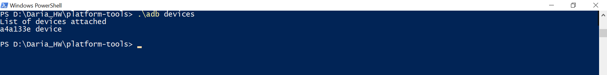
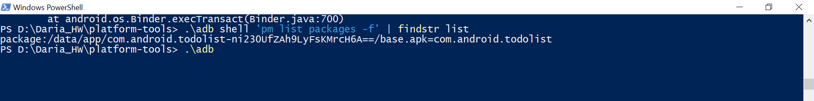

 ## Android Debug Bridge (ADB)

 #### 1. Display the device connected in the console
```
.\adb devices
```
<div style="display:flex;">

</div>
 
 #### 2. List address of todolist app in the Android system
 ```
.\adb shell 'pm list packages -f' | findstr list
```
<div style="display:flex;">

</div>
 
 
 #### 3. Install .apk file of todolist app to the device from the laptop using ADB
 
 #### 4. Take a screenshot of the opened todolist app and copy it to the laptop by one command 
 
 #### 5. List logs of todolist app to console
 
 #### 6. Copy logs of todolist app to the laptop
 
 #### 7. Delete todolist app from the device using ADB
 
